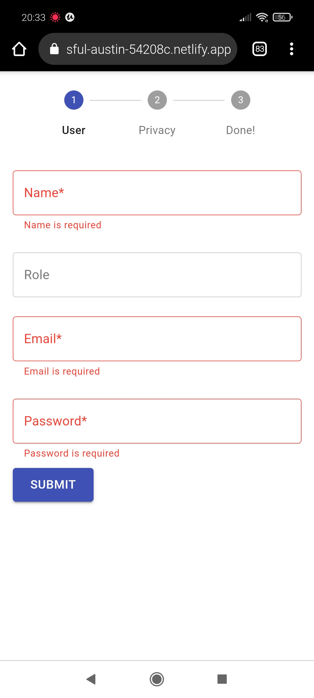

# Multi step form

## Overview

This is a React/Redux SPA application that shows a web form to collect data from a user
before signing up for a service. The app is fully responsive and live demo version can be accessible on different screen sizes.
The app consists of 3 pages, which have different Urls. User can't proceed to the next page until they fill in all required fields and submit the data. User can see their progress on the stepper on the top of each page. If the user hasn't submitted the form they can still amend the data. When they get to the last page the user input data could be found in the console and also user can review their data by using `back` button, however they can't amend input fields. After form submission user also could see a `reset` button, which resets the form and redirects the user to the first page.

## Live demo version

[Live version of the app can be found on Netlify](https://nervous-colden-1b4207.netlify.app/).

## Running The Project

From the repo:

1. Clone this repo into your local machine.
2. Run `cd multi-step-form` in your bash/command line
3. Run `npm install` in your bash/command line.
4. Run `npm start` in your bash/command line.
5. Open [http://localhost:3000](http://localhost:3000) to view it in the browser.
6. `npm test` to run tests

## Folder structure

- routes
- components
- pages
- redux

## Tech Used / Dependencies

- This project was bootstrapped with [Create React App](https://github.com/facebook/create-react-app).
- `Typescript` for type checking.
- `Material UI` was used to create screens.
- `Formik` and `Yup` for form validation.
- `Redux` for state management. Two redux flows was created: one to store user input data, and second one to store form progress(completed steps and if the form was submitted information)
- The `Redux DevTools Extension` to track the history of the changes to the state in Redux store over time.
- `React router` was used to create tre pages routes
- `reselect` was used to create reusable store selectors.
- `Jest` for unit testing
- [Prettier](https://www.npmjs.com/package/prettier) to format code.

## Improvement

1. Add more tests.
2. Improve folder structure(for example inside redux two folder could be created to put there all actions, reducers, selectors for form progress and other for user input data)
   3.On submit final page a spinner could be added to show it to the user while api call is in progress.
3. Add icon button to hide or reveal the password.
4. Add onRevisit form functionality. If the user hasn't submitted the worm and they want amend the data on previous page. If they changed prepopulated field add reminder that to save changes they have hit submit button, otherwise next button.

## App Preview

First page: user is on landing page and they hit submit without filling in the form (screen 1)  

 

User consent page (screen 2) 

 

Success page (screen 3) 
 

User consent page- revisited after form submission (screen 2) 
 
